# PawSafe

PawSafe is a pet-care web application designed to help users manage their pet-related journey in one place.

## About The Application

PawSafe provides a clean and simple experience for users to:

- create an account
- log in securely
- access a personal dashboard
- view user-focused content in protected pages
- manage pet information and reports through RESTful APIs

## Main User Journey

1. User opens the app and lands on the login page.
2. New user can go to registration page and create an account.
3. User logs in with valid credentials.
4. User is redirected to the dashboard.
5. User can access personal pages available only after login.
6. User can manage pets and view pet reports through the dashboard.

## Purpose

The current focus of PawSafe is to deliver a smooth user account experience and provide a strong base for adding more pet-care features in future versions.

---

## Technology Stack

### Backend
- **Framework**: Django
- **Language**: Python 3
- **Database**: SQLite3
- **API**: Django REST Framework

### DevOps & CI/CD
- **Container**: Docker
- **Build Tool**: Maven (via pawsafe-ci module)
- **Orchestration**: Docker Compose

---

## Project Structure

```
pawsafe/
├── accounts/              # Django app for user authentication and pet management
│   ├── migrations/        # Database migrations
│   ├── models.py          # User, Pet, PetReport models
│   ├── serializers.py     # REST API serializers
│   ├── views.py           # API views and authentication logic
│   └── urls.py            # API routing
├── templates/             # HTML templates for web interface
├── media/                 # User-uploaded content
├── pawsafe/               # Django project configuration
├── pawsafe-ci/            # Maven-based CI/CD module
│   └── pom.xml            # Maven build and test configuration
├── docker-compose.yml     # Container orchestration
├── dockerfile             # Docker image definition
├── manage.py              # Django management script
└── db.sqlite3             # SQLite database file
```

---

## API Endpoints

### Authentication
- `POST /accounts/login/` - User login
- `POST /accounts/register/` - User registration
- `POST /accounts/logout/` - User logout

### Pet Management
- `GET/POST /accounts/api/pets/` - List and create pets
- `GET/PUT/DELETE /accounts/api/pets/<id>/` - Retrieve, update, or delete a pet

### Pet Reports
- `GET/POST /accounts/api/reports/` - List and create pet reports (text, photo, lost, found types)
- `POST /accounts/api/reports/<id>/like/` - Like a pet report

---

## Getting Started

### Prerequisites
- Python 3.8+
- Docker & Docker Compose
- Maven 3.6+

### Installation

1. **Clone the repository**
   ```bash
   git clone https://github.com/Sakura-winter/PawSafe.git
   cd pawsafe
   ```

2. **Install Python dependencies**
   ```bash
   pip install -r requirements.txt
   ```

3. **Apply database migrations**
   ```bash
   python manage.py migrate
   ```

4. **Run the development server**
   ```bash
   python manage.py runserver
   ```

Access the application at `http://localhost:8000`

---

## CI/CD Pipeline

### Workflow Diagram

```mermaid
graph TD
    A["👨‍💻 Developer"] -->|git push| B["🐙 GitHub"]
    B -->|webhook trigger| C["GitHub Actions CI"]
    
    C -->|Install deps| D["Python 3.12 + Java 17"]
    C -->|Run tests| E["Django Tests"]
    E -->|SQLite in-memory| F["CI=true"]
    C -->|Maven test| G["mvn test<br/>Maven runs Django"]
    
    G -->|Tests pass| H["GitHub Webhook<br/>POST to ngrok URL"]
    
    H -->|Tunnel| I["ngrok<br/>Internet → localhost"]
    
    I -->|Webhook trigger| J["🔧 Jenkins CD Pipeline"]
    
    J -->|git pull| K["Latest Code"]
    J -->|Build & up| L["docker compose up --build"]
    
    L -->|Wait ready| M["⏳ DB Ready Check"]
    J -->|Migrate| N["manage.py migrate"]
    
    M --> O["🐳 Docker Compose"]
    N --> O
    
    O -->|Container 1| P["Web: Django<br/>Port 8000"]
    O -->|Container 2| Q["DB: MySQL 8<br/>Port 3306"]
    
    P --> R["✅ Application Live"]
    Q --> R
    
    R -->|Ready| S["localhost:8000<br/>🐾 PawSafe Live"]
    
    style A fill:#e8f4f8
    style B fill:#1e3a8a
    style C fill:#1e3a8a
    style H fill:#78350f
    style I fill:#78350f
    style J fill:#7c2d12
    style O fill:#064e3b
    style S fill:#15803d
    style G fill:#5b7c99
```



### Pipeline Stages Explained

| Stage | Tool | Purpose |
|-------|------|---------|
| **CI - Test & Validate** | GitHub Actions | Automated testing on every push |
| **Webhook/Tunnel** | GitHub Webhook + ngrok | Secure communication from cloud to local |
| **CD - Build & Deploy** | Jenkins | Automated deployment pipeline |
| **Containerization** | Docker Compose | Spin up Django + MySQL services |
| **Live App** | Docker | Application running and accessible |

### Local Development Testing

Run Django tests using Maven:
```bash
cd pawsafe-ci
mvn test
```

This executes all Django unit tests defined in the `accounts/tests.py` module.

### Docker Setup

Build and run the application using Docker Compose:

```bash
# Build Docker image
docker-compose build

# Start the application
docker-compose up

# Stop the application
docker-compose down
```

The application will be available at `http://localhost:8000`

### Maven Configuration (pawsafe-ci)

The CI/CD pipeline uses Maven as an orchestrator to:
- Execute Django test suite during the `test` phase
- Manage project dependencies and build lifecycle
- Provide a unified build interface across development and CI/CD environments

The `pom.xml` configuration:
- Uses `exec-maven-plugin` to run `python manage.py test`
- Runs tests from the parent Django project directory
- Integrates with continuous integration servers (Jenkins, GitLab CI, GitHub Actions, etc.)

---

## Development Workflow

### Running Tests
```bash
# Via Maven (recommended for CI/CD)
cd pawsafe-ci
mvn test

# Via Django directly
python manage.py test
```

### Database Management
```bash
# Create migrations
python manage.py makemigrations

# Apply migrations
python manage.py migrate

# Create superuser
python manage.py createsuperuser
```

### Static Files
```bash
# Collect static files
python manage.py collectstatic
```

---

## Contributing

When contributing to PawSafe:
1. Ensure all tests pass (`mvn test`)
2. Follow Django best practices
3. Update tests for new features
4. Use proper commit messages

---

## License

[Add your license information here]
